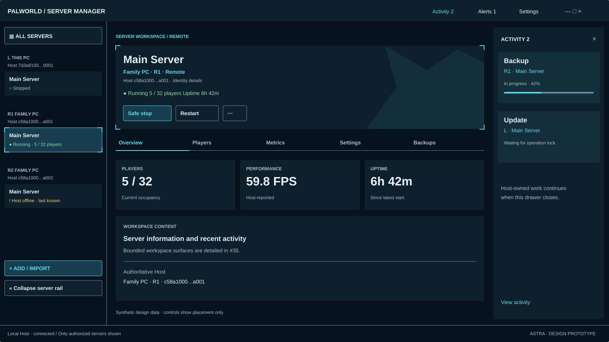
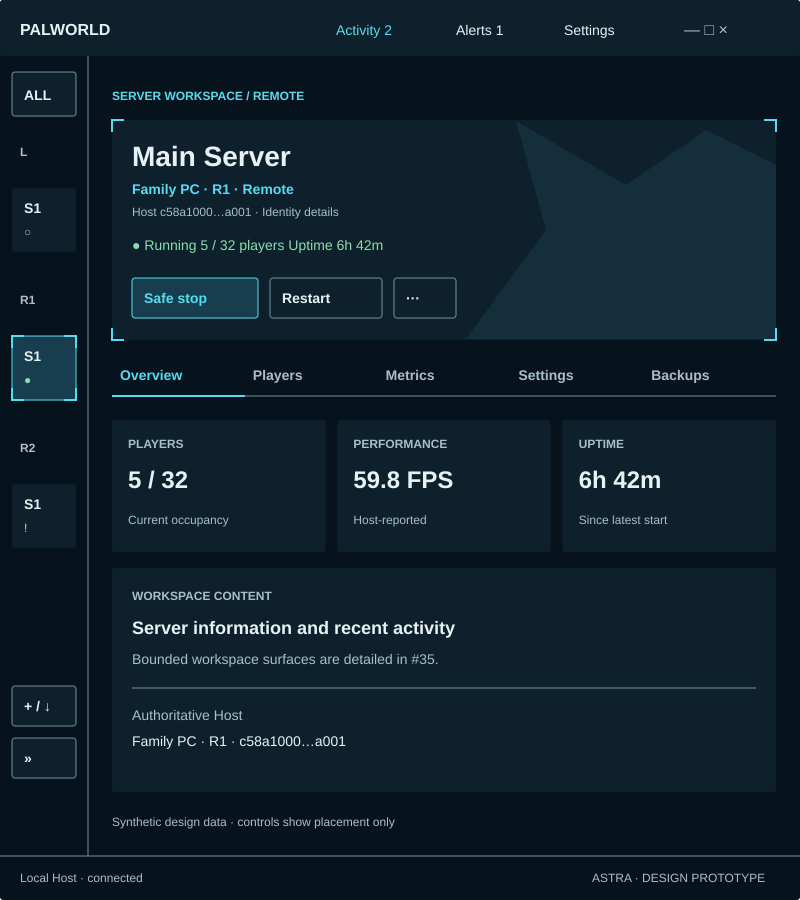

# Astra #34 — shell and component foundation

Trial reference: [#34](https://github.com/shoemin/Palworld-Server-Manager/issues/34), parent [#18](https://github.com/shoemin/Palworld-Server-Manager/issues/18). These are **static design prototypes**, not a working client. All data is synthetic. No displayed action calls a Host or changes a server. Scope ends at shell/component/rail foundations; #35–#38 own the detailed surfaces and final cross-surface acceptance.

## Boards

| Artifact | Evidence |
|---|---|
| [16:9 shell](shell-16x9.svg) | 1600×900; local plus two remote Hosts; selected remote server; right Activity drawer |
| [21:9 shell](shell-21x9.svg) | 2100×900; fixed rail/drawer with expanded central workspace |
| [Narrow shell](shell-narrow.svg) | 800×900; permanent collapsed rail, global controls and selected Host remain present |
| [Narrow identity](shell-narrow-identity.svg) | Keyboard focus exposes the exact identity of a collapsed row, without selecting it |
| [Components](components.svg) | Default, hover, selected, focus, new, offline, degraded, unavailable; full identity expansion |
| [Dark Minimal](shell-dark.svg), [Light Minimal](shell-light.svg) | Same structure and dimensions; semantic palette replacement; angular decoration removed |

## Relationship to the accepted concept

The canonical #18 mockup was visually inspected through the in-app browser at natural image size. Earlier Edge capture failures were resolved; there is no remaining reference-image gap. This slice retains its compact permanent rail, cyan corner frame, dark blue/teal surfaces, horizontal server tabs, clear header hierarchy and right-side nonblocking Activity location. It replaces the mockup's game image/avatar with an original geometric horizon, avoiding unlicensed assets. Mockup-only Files/Logs labels are not added as new capabilities: the accepted parent lists Overview, Players, Metrics, Settings and Backups, with bounded parity actions left to #35. The canonical mockup's duplicated settings entrances are consolidated into one global Settings control, whose accessible name is “Manager Settings.”

The large interior panel is deliberately annotated as the next slice's content. It demonstrates the available composition area without pre-designing the settings editor or activity flows. Placeholder annotations are design documentation and must not ship in product UI.

## Shared components and tokens

[tokens.json](tokens.json) is the semantic source; [generate.py](generate.py) produces the boards reproducibly. Use its theme keys rather than screen-specific color literals. `canvas` is the app backdrop; `surface` contains content; `raised` provides hover/transient emphasis; `selected` distinguishes current navigation; `accent` is selection/focus/action emphasis. Status uses `success`, `warning`, `danger` **and** an explicit label or shape. `border` supplies interactive boundaries. `text`/`muted` remain readable on every supported surface; neither denotes disabled authority.

The 4/8/12/16/24/32/48 spacing scale, 12/14/18/28/32 type scale, 40-unit controls, 64-unit rail rows and 3-unit corners preserve compact desktop density. Body text is 14 units; 12 is reserved for secondary labels. System UI font stack is Segoe UI → Arial → sans-serif; no third-party font is redistributed. Original line/corner/geometry primitives and ordinary text glyphs form the icon language; glyph-only controls require the same accessible names/tooltips as their labeled equivalents. Do not rely on a decorative glyph being available to communicate state. All interaction targets are at least 40×40 units. OS window controls remain native/accessible equivalents; they are schematic on the boards.

Reusable primitives: AppChrome, ServerRail, HostGroupHeader, ServerRow, HostIdentityLabel, ActionButton, ServerTab, StatusLabel, MetricSummary and ActivityEntry. Row selection is corner framing plus selected fill; keyboard focus is a separate double outline, retained even on a selected row. Hover never replaces focus. New means newly presented server, not newly granted authority. Degraded means a specific unavailable observation (for example metrics), never blanket permission to mutate. Offline values are marked last-known with an observation timestamp in the eventual data view; actionable live state is never inferred from cached values.

## Identity and navigation contract

The rail is fed only by the authenticated local Host's authorized inventory; no unshared remote server, hidden count or inferred placeholder is shown. Pairing by itself produces no server entitlement. All Servers aggregates that same filtered set. This PC is the local authoritative Host, not direct process/file access. Remote groups retain their authoritative Host identity even when the local Host forwards operations.

Navigation and selection keys are the full `(AuthoritativeHostId, ServerProfileId)` pair. Labels are presentation only. The fixtures deliberately repeat **Main Server**, **Family PC**, the first eight HostId characters, and the full profile UUID across distinct Hosts. The expanded rail shows an ID suffix; the selected header always says Remote/This PC and provides identity details. The details surface exposes both full UUIDs as selectable text. A credential fingerprint is never substituted for HostId.

`L`, `R1`, `R2` and `S1` are compact display aliases, not database IDs or privileges. Keep them stable while the current inventory is displayed; never reuse an alias for a different Host while any visible row, detail, or operation references it. Collisions in shortened IDs require more visible ID characters or the full ID; never assume first-eight/last-four is universally unique. The supplied fixture check proves only these examples. At narrow widths, focus/hover on a rail item exposes its full name, Host name, location and IDs as shown on the identity board; accessible names always contain the same information. A row can be inspected without changing selection. Selection revalidates the full target through the Host.

Add/Import stays at the rail foot and selects a destination in #35; it never silently targets whichever Host happens to be selected. Manager Settings is global. Activity and Alerts remain reachable from chrome regardless of rail state. Trust/transport is infrastructure and does not become an extra permanent navigation section.

## Responsive behavior

Dimensions are device-independent design units. The fixed-size boards intentionally demonstrate both requested aspect ratios; they are not screenshots of Avalonia. At 1600 and 2100 the rail stays 280 and the Activity drawer 304, while the center absorbs width. Central rows/cards may span the additional width; do not increase font size or inflate card padding just because a screen is ultrawide.

Below 1200 units the rail defaults to 88-unit collapsed mode, and Activity opens as a dismissible right overlay instead of squeezing the workspace. The collapsed rail never disappears. Opening the full rail temporarily overlays 280 units and returns focus to its expand control when dismissed; it does not change the selected Host. At 800 units all chrome entries, five tabs and the selected Host remain visible. Below the demonstrated width or at enlarged text scale, prioritize wrapped Host labels, vertically reflowed metric summaries and tab-strip scrolling with visible navigation affordances; do not clip labels or remove actions. These smaller/extreme text-scale cases are acceptance work in #38, not a newly declared minimum supported window size.

Rail groups scroll independently above the pinned Add/Import controls. A focused row must scroll into view. Long names wrap to two lines, increasing row height; the Host identity line never disappears. Expanded identities can wrap UUIDs at separators while exposing the uninterrupted value for copy/assistive technology. Dynamic alias collision changes cannot silently redirect an existing selection. Activity overlay closing preserves the underlying workspace and Host-owned work; no backdrop cancels an operation.

## Keyboard, focus and motion

Tab order follows chrome → rail → workspace → open drawer. Each region has a heading/landmark. The rail uses a grouped tree pattern: arrow keys move focus among visible items, Left/Right collapse/expand Host groups, Home/End move within the tree, and Enter selects the focused server. Selection does not follow focus automatically. Tab enters/leaves the tree at its current focused item. A collapsed row reveals its identity on focus as well as hover; Escape dismisses the identity panel and preserves focus. A dismissible panel returns focus to its opener; nonmodal Activity does not trap keyboard focus. Tooltips contain no essential information absent from accessible names or focusable details.

Unavailable actions expose a reason (“Host offline”, “Not authorized”, “Unsupported capability”, or “Operation locked”) without revealing hidden resources. They are not enabled by visual theme, pairing or local OS-group eligibility. Focus outlines are two units, contrast at least 3:1 against all surfaces, and remain visible at 200% text scale in the later live prototype. Feedback may fade over 100 ms and panels over 160 ms; reduce motion changes both to zero. No pulsing status, scrolling texture or moving backdrop. Color never carries the only distinction; screen-reader verification belongs to production accessibility qualification, not a claim made from SVG.

## Authority and scope audit

Lifecycle controls are placement examples for Host-authorized operations, not client process launchers. The ordinary client routes remote work through its local Host and never possesses the machine identity key. Status/permission/capability inputs come from the Host; a visual disabled state is never the security boundary. A last-known offline row cannot authorize writes. Exact targets also appear on Activity summaries so two identically named servers cannot be confused. The drawer cannot cancel or release a lock by closing. No secret, enrollment code, grant editor, bootstrap shortcut, permission preset or arbitrary filesystem path is introduced here.

## Validation and limits

Run `python docs/design/astra-34/generate.py --check` to verify generated SVGs, XML structure, example identity uniqueness, all semantic text contrasts (at least 4.5:1), interactive boundary/focus contrasts (at least 3:1), and token reproducibility. Run `python -m mkdocs build --strict` for documentation. Regenerate with the same command without `--check` after intentional source edits. Render SVGs with a standards-compliant viewer and inspect all seven boards. The trial used the bundled Sharp renderer for local PNG inspection; PNGs are evidence, not duplicated source artifacts.

Pass A and Pass B results, including corrections, are in the [trial ledger](../../experiments/astra-v0.5.0-trial.md). Static rendering proves geometry and visual direction, not live keyboard behavior, screen-reader support, real services, or final cross-surface user acceptance. Those are not represented as passing here. #38 retains the final design acceptance gate and #52+ the relevant production validation.
