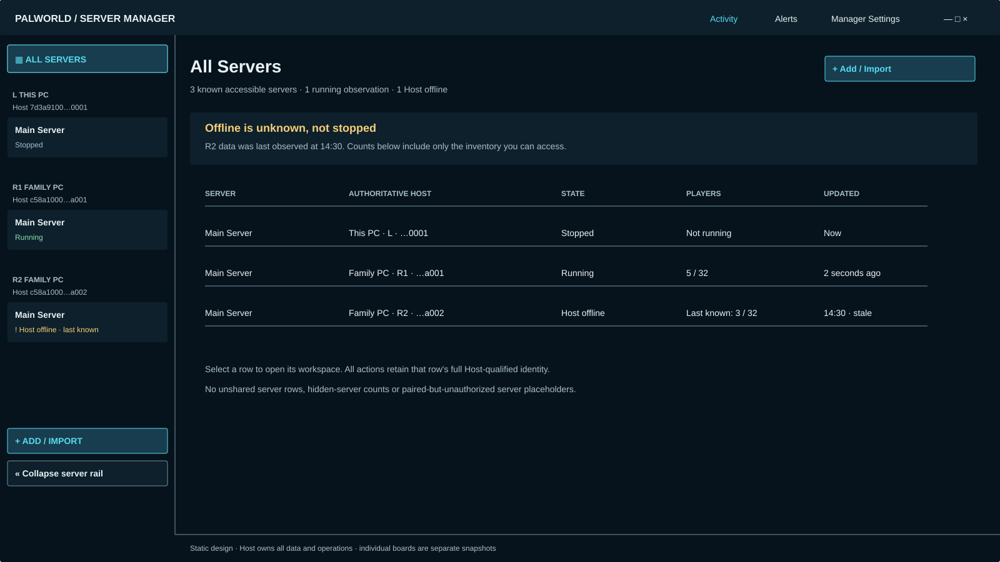
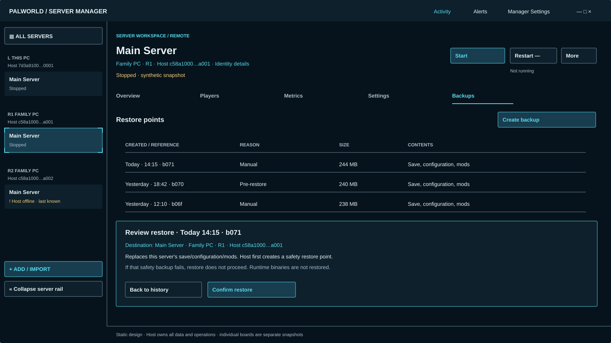

# Astra #35 — server workspace and guided creation/import

Trial reference: [#35](https://github.com/shoemin/Palworld-Server-Manager/issues/35), parent #18. Consumes the accepted [#34 foundation](../astra-34/README.md). This is a static design package using synthetic data. Each board is a separate snapshot, not simultaneously observed live state. No production UI or Host behavior is implemented.

| Board | Bounded evidence |
|---|---|
| [All Servers](fleet.svg) | Unified filtered inventory, duplicate names, distinct Hosts, offline counts |
| [Remote overview](overview.svg), [Local overview](overview-local.svg) | Same surface, exact selected Host, useful summaries, visibly unavailable actions |
| [Players](players.svg) | Dense semantic roster; advanced identity details off by default |
| [Metrics](metrics.svg) | Units, last-known state, missing-data gap, no false live continuation |
| [Backups](backups.svg) | Restore-point history, stopped state, exact destination, safety backup |
| [Create](create.svg) | Sequential destination → details → review, including remote creation |
| [Import](import.svg) | Sequential package verification → destination → review |

## One workspace, exact authority

All Servers and the permanent rail consume the same local-Host-authorized inventory. No unshared server name, placeholder or hidden count is shown. A visible server may have actions the current principal cannot perform; those action controls stay visibly unavailable with a reason. Denial of visibility removes the entire resource instead. Paired does not mean visible or authorized. Cached rows survive only under the Host's current known visibility policy; a reported revocation removes their data rather than leaving a clickable stale resource.

The key of every selection, request, stream and confirmation is `(AuthoritativeHostId, ServerProfileId)`. Identical labels never determine a destination. Full IDs remain available through the #34 identity panel. The same surface is used for This PC and Remote; only the authoritative Host label, available capabilities and returned data differ. A display alias or credential fingerprint never substitutes for HostId. All remote operations and observations route through the local Host, which enforces local authority before the destination independently enforces peer authority.

Fleet totals summarize only known accessible observations: “1 running observation” does not claim an offline server is stopped. Sorting/filtering is over that authorized inventory. Selecting a row opens its scoped workspace; a new observation cannot silently switch the selected full identity. Loading, no accessible servers, and unavailable inventory are distinct states: respectively show progress, the Add/Import entry where authorized, or the actual Host/channel error. Never show an empty fleet as proof no remote servers exist.

## Overview, Players and Metrics

Overview uses the baseline dashboard's bounded data: state, version/uptime where reported, current/max players, FPS/frame time, world information, ports and last Manager backup. Synthetic numbers are examples, not new defaults. “Unavailable” is distinct from zero, stopped, and never observed. Monitored/external/exiting state and unrecoverable exit-code observations must use the Host's explicit labels from #50; a client must not infer a clean exit.

Players uses name, level, ping, building count and location rather than raw JSON. Advanced Details is an explicit disclosure for existing account/user/network fields; it never exposes credentials. Missing location remains unavailable. No kick/ban/chat/teleport feature is added. Roster and metrics are bounded Host read models; the client has no direct Palworld REST connection, log-file reader or generic proxy.

Metrics shows FPS, frame time and player history with unit labels, numeric ticks, observation times and gaps. Any line stops at the last actual sample; stale data cannot be extended to “now” by interpolation. Cadence/retention are Host-supplied, not a promise of new durable history. The traces use synthetic samples with labeled illustrative ranges; production ranges derive from observations and require an accessible data summary. Player count uses steps so integer observations do not look fractional. No request-overlap or streaming policy is chosen by this design. Degraded REST availability may coexist with an independently known running process; do not collapse them into one boolean. Its rail row also identifies REST data as stale instead of showing an apparently current player count.

## Backup history and restore selection

Use restore-point concepts: timestamp, reason, size, and save/configuration/mods contents. Avoid exposing raw archive filenames or arbitrary filesystem browsing. The row and review show the same shortened Host-issued reference (synthetic `b071`); if shortened references collide, expand them. The full opaque reference identifies the selected point, never a formatted timestamp or “latest.” Restore is scoped to the currently selected exact server and exact restore point; do not silently choose “latest” again at submission. Stopped state is required for filesystem backup/restore under accepted parity; a running server shows those actions unavailable with “Stop server first.” Selecting a restore point does not automatically stop a server or execute anything.

The review panel names both server and authoritative Host, states what will be replaced, and explains the required pre-restore safety backup. If creating that backup fails, restore does not proceed. No runtime binaries are restored from this save backup. Confirmation initiates a bounded Host operation after fresh authorization/state/lock checks; a client must not bypass those checks because its cached button was enabled. Detailed conflict/progress/recovery presentations belong to #38. No new delete-backup, retention or cross-server restore policy is selected here.

The backup board depicts a stopped R1 snapshot consistently in header and rail. Other boards may depict R1 running. This explicitly avoids the escaped #34 running-backup fixture defect recorded and corrected in the trial ledger.

## Guided Add / Import

The three-panel boards are **storyboards of successive screens**, not a giant simultaneous form. One panel is shown at a time. Back preserves the draft; Cancel before submission leaves no operation. The destination is explicit, retained and repeated on review. A selected workspace does not implicitly select the Add/Import destination.

Create: choose an eligible authoritative Host → enter/validate the bounded profile details → review the exact Host and proposed server → submit once. A remote destination needs both the initiating local principal's exact-target `CreateServer` grant and the remote peer's independent authorization, supported capability and usable trust state. No fake ServerRef is invented before the profile exists: creation is a Host-targeted operation. After success, use the Host-returned canonical new ServerRef. No creator-side implicit Owner or permission assignment is invented by the wizard.

Import: choose a `.palserver` package through the bounded input handoff → validate manifest and per-file hashes → choose an eligible destination → review verified payload and destination → submit. The storyboard's first step includes package selection/validation, not a generic remote file picker. The original package remains untouched. Invalid/tampered/incomplete packages cannot be accepted as valid or adopted. Runtime binaries remain excluded; SteamCMD supplies a fresh runtime at the destination. Import creates a new profile and never silently overwrites an existing one. Host-owned cleanup/operation phases follow #49; UI does not perform installation or extract files itself. This input handoff does not create a generic client filesystem-management authority.

Changes to destination, capability, validation result or authorization invalidate the review. Remain on the review screen with the specific reason; do not silently reroute or queue offline work. Once the Host accepts the operation, open/refer to its Activity identity. Reopening the wizard must not resubmit accepted work merely because a response was lost; use the operation identity/status reconciliation provided by the Host contract. This design does not invent transport idempotency tokens, lock queues, resumable transfer, or rollback beyond accepted behavior.

## State and action matrix

| Condition | Read presentation | Action behavior |
|---|---|---|
| Live and authorized | Fresh observation time and exact Host | Allowed only if Host reports the capability and state prerequisites |
| Server stopped | Stopped, live process observation; no invented zero REST data | Start where authorized; backup/restore can proceed only after Host checks |
| Host offline | Last-known marker/time; unavailable where no cached value | No mutation, no offline queue; explain “Host offline” |
| REST degraded | Process status and REST availability separately labeled | REST-dependent action unavailable with precise cause |
| Unauthorized action on visible resource | Keep permitted observations | Visible unavailable control, “Not authorized”; no grant shortcut |
| Resource visibility revoked | Remove resource data/selection safely | No leftover action or leaked hidden-resource label |
| Unsupported capability/protocol | Show available data and feature-specific reason | Never infer support from app version or fall back to direct client access |
| Operation lock | Safe read-only observations remain | Mutation unavailable/rejected by Host; no client-side unlock; #38 owns detailed presentation |
| Restore/package validation failed | Explain bounded validation result without secrets | No confirm/execute until corrected; no partial adoption |

Local “Open folder” may use only the bounded Host-authorized local resource and interactive-client platform seam defined by #19. Remote folder opening is visibly unavailable, never UNC access or a generic remote file browser. Other missing/unapproved capabilities must not be introduced to populate the More menu.

## Responsive and accessible composition

These surface boards use 16:9; the shared #34 shell supplies ultrawide and narrow layout behavior. At ultrawide, expand the central table/chart area without widening line lengths indefinitely. At narrow widths, tables prioritize name, Host, state/time, then reveal remaining fields in a labeled row-detail region; identity must not disappear from a horizontally clipped column. Metrics stacks charts and their accessible summaries. Guided flows remain one step with Back/Continue and destination context. Backup history precedes its review panel vertically. Keyboard selection and restore review are separate steps; a focused row alone never triggers an action. Carry #34 focus, minimum targets, disclosure, motion and palette rules into every surface. #38 provides the final cross-surface/extreme-size evidence.

## Verification

Run `python docs/design/astra-35/generate.py --check`, the #34 generator check and `python -m mkdocs build --strict`. Regenerate without `--check`; render all eight SVGs and visually inspect identity, freshness, safety, typography and overflow. Evidence is static; no live Host, keyboard or screen-reader execution is claimed. Scope/invariant audits and the two distinct review passes are recorded in the [trial ledger](../../experiments/astra-v0.5.0-trial.md).

Requirement sources: accepted [architecture](../../developer/v0.5-architecture.md), canonical #18/#35/#49/#50 bodies, and frozen-baseline [dashboard](../../guide/dashboard.md), [backups](../../guide/backups.md), [package semantics](../../guide/portable-packages.md). Legacy guides inform bounded parity facts; their v0.4 process/transport/storage ownership does not override the v0.5 Host model.
