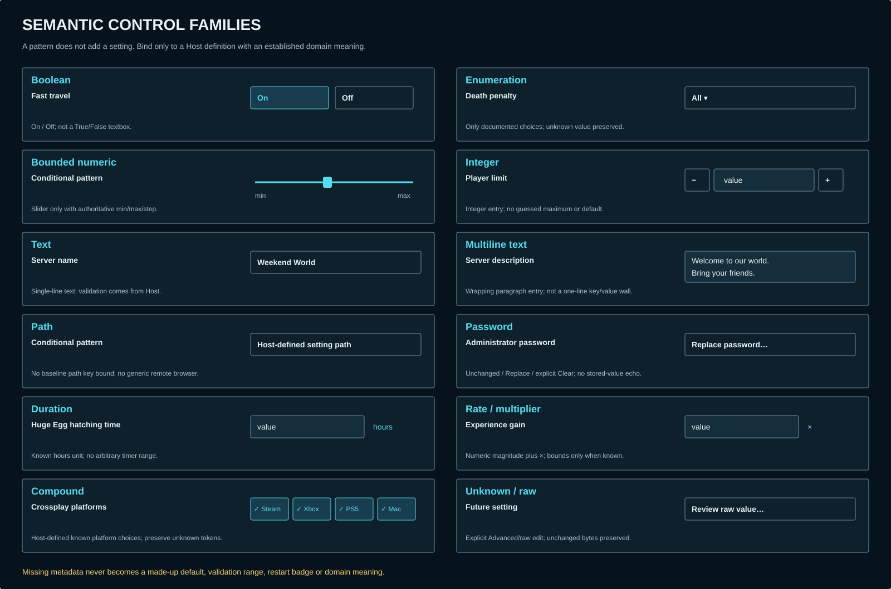

# Astra #36 — semantic Server Settings

Trial reference: [#36](https://github.com/shoemin/Palworld-Server-Manager/issues/36), parent #18. Static design only; no Core catalog/parser or Avalonia implementation. Uses the [#34 foundation](../astra-34/README.md) and [#35 workspace](../astra-35/README.md). All configured/draft values are synthetic examples, not defaults for a Palworld installation.

| Board | Evidence |
|---|---|
| [16:9 editor](settings-16x9.svg) | Categories/search, semantic controls, changes and Save/Discard |
| [21:9 editor](settings-21x9.svg) | Same hierarchy with central width adaptation |
| [Narrow editor](settings-narrow.svg) | Collapsed permanent rail, category selector, stacked controls |
| [Expanded narrow row](settings-narrow-details.svg) | Visible details affordance, unavailable Reset and per-setting Revert |
| [Control families](control-families.svg) | Twelve semantic patterns; conditional patterns do not invent setting definitions |
| [Save/navigation states](save-states.svg) | Invalid draft, running server, leave with changes |
| [Advanced/secrets](advanced-secrets.svg) | Unknown preservation, unchanged/replace/clear distinction and redaction |

## Authority and metadata contract

The ordinary client consumes the Host's schema/value DTOs for the exact `ServerRef`; it does not reference Core, parse INI or open a settings file. Local and remote editors use the same surface, always naming the authoritative Host. The Host owns validation, serialization, authorization, revision checks and the write. Remote requests route through the local Host and require both authorization boundaries. No presentation fallback bypasses missing capability or trust.

The frozen baseline `PalworldSettingSchema` establishes names/categories/descriptions, known enum choices and some units. `PalworldSettingsService` obtains optional defaults from that server installation. General numeric limits/steps/restart metadata are not established by that schema. Therefore this design **does not supply them**. #47 may provide metadata only from established knowledge. An absent default means Reset is unavailable; an absent range means no bounded slider; an unknown restart rule means “Not reported,” not a restart badge or a claim that saving applies live. Unknown effective values are not reconstructed from configured values.

Concrete examples use established meanings: fast travel is boolean; experience gain is a multiplier; DeathPenalty choices are None, Item, ItemAndEquipment and All; administrator password is secret. Units for Huge Egg hatching time (hours) and crossplay platform examples come from the accepted baseline descriptions. The player limit is integer-shaped by domain meaning, but no maximum/default is chosen here. Path and bounded-slider cards are **unbound conditional templates**, not new settings or guessed semantic classifications. If a real setting cannot be classified from the Host's known definition, preserve it through Advanced/raw; do not make a product guess to activate a template.

## Semantic selection and layout

| Meaning | Control composition | Missing/unknown metadata |
|---|---|---|
| Boolean | Labeled On/Off segmented control or switch with explicit state | No truthiness guessing from arbitrary strings |
| Enum | Named choice list, readable labels, current choice | Preserve an unknown current choice; never silently coerce to first item |
| Bounded number | Value entry plus slider, visible min/max/unit/step | No slider until bounds/step are actually defined |
| Integer | Numeric entry/stepper honoring known integer domain | No invented maximum/default; Host validates |
| Text / multiline | Name input or softly wrapping description area | Stored line breaks only if schema allows; no guessed length/regex rule |
| Path | Text for a defined bounded Host setting; explicit Host context | No new path key, generic browse or UNC/remote filesystem authority |
| Password | Unchanged / Replace / explicit Clear, masked new draft | Never fill with a stored secret or submit a placeholder as a new value |
| Duration | Numeric magnitude with documented unit | No guessed unit conversion or timer range |
| Rate / multiplier | Numeric value with semantic unit such as × | Not automatically a percent or bounded slider |
| Compound | Named subcontrols for known structure, preserved unknown tokens | No destructive splitting/reassembly of an unknown shape |
| Raw / future | Explicit Advanced/raw value editor with warning | Preserve all unrelated unknown entries and comments |

Normal pages group related semantic cards rather than flattening keys into identical textboxes. All settings, Server management, Performance, Features, Game balance and Advanced/unknown follow the established category vocabulary. Search matches display name/description and may expose a technical key as secondary context; it never searches secret values. Results retain category and exact server context. Empty search and no matching results are distinct from schema unavailable. Changing category/search never commits or discards draft changes.

At 1600/2100 units categories remain a compact left column and fields share the main area. At 800 units the rail remains collapsed and categories become a selector; labels/descriptions precede their controls. Additional row details (default, per-setting reset/revert, effective/restart metadata) expand below the row, never disappear permanently. Long localized labels wrap and increase row height. The main footer remains reachable by scrolling and names the unsaved count. The static boards illustrate one small subset, not a complete hard-coded catalog.

## Modified state, reset and save

Keep loaded configured value, optional reported effective value, draft value, metadata and revision conceptually separate. A modification marker means draft differs from loaded configuration; editing back to the original clears it. `Revert` restores the loaded configured value without saving. `Reset` copies a supplied default into the draft and marks it modified when different; it never guesses a default or immediately writes. Secret resets require the same explicit secret-update semantics as other secret edits and must never reveal a stored/default secret.

The illustrated two modifications are Fast travel Off→On and experience gain 1.0×→2.0×. They are fixture values only. Unchanged DeathPenalty and administrator password are not counted. Discard restores the full loaded draft; with changes present it must be a deliberate user action. Save remains unavailable while invalid, offline, unauthorized, unsupported, or running where accepted parity requires stopped state. The server can be viewed and drafts composed while running, but saving requires it stopped. Do not automatically stop/restart a server to make Save succeed.

Save submits the exact target and loaded revision through the Host. Success is acknowledged with the returned revision; then establish the new loaded baseline. Failure leaves the draft and explanatory error. A stale revision is rejected, not force-overwritten or silently merged; #38 supplies the detailed review/reload flow. No offline queue is introduced. Losing the response requires Host status reconciliation before asserting success or resubmitting; this design does not invent a transport/retry API.

Navigating away with changes offers Stay, Discard and leave, and Save and leave only if Save is currently allowed. Stay preserves focus/draft; Discard leaves persisted configuration unchanged; Save and leave waits for success before leaving. Closing a client never converts an unsaved draft into an effective configuration. This slice does not introduce persistent local draft storage, especially for secrets.

## Validation, configured/effective and restart states

Validate according to known metadata and show a field-local explanation plus a summary linked to the first invalid field. The example “two” is invalid for a known numeric multiplier without inventing a numeric range. Preserve the user's entered text so it can be corrected. Client validation is helpful feedback, not the security boundary. Host validation remains final, including latest state, exact target and revision.

Configured and effective values may be compared only when the Host supplies an actual observation for that exact setting/server. Missing or stale observations remain labeled with their time/unknown status; never show configured value as “effective” by default. A known restart-required flag may add a badge beside that setting and a summary after acknowledged save. Unknown restart behavior is explicitly not reported. No restart-required flag is fabricated merely because a setting appears to affect gameplay. An editor may still require a stopped server to save under parity even when per-key restart metadata is unknown.

## Unknown values and secrets

Unknown/future keys are preserved non-destructively through the project-owned Host parser/model. Raw editing is an explicit setting-value operation, not arbitrary INI/file access. An unrelated save must not normalize unknown entries, drop comments, discard unknown enum/compound tokens or rewrite them to defaults. If the client lacks enough schema to edit a value safely, it remains preserved/read-only until an explicit raw edit is supported; unsupported schema does not justify a raw-file bypass.

The Host redacts secret material before any normal/raw/effective/error/comparison/search/diagnostic presentation. A replacement control must distinguish no change, newly entered replacement and explicit clear. “Stored · unchanged” is status text, never a persisted password or bullet-string value. An empty replacement is not implicit deletion. Only newly typed draft text may be revealed locally through a deliberate control; existing stored secrets are not echoed. Clearing requires explicit intent and the same Host validation/write path. Revert/discard destroys the pending replacement from the UI's active draft; no logs, telemetry, clipboard auto-copy, diagnostic capture or on-disk draft is created. Platform/store implementation remains #27/#47 and is not decided here.

## Keyboard, accessibility and motion

Use the #34 focus/contrast/minimum-target rules. Tab enters search, categories, then setting controls and footer; arrow keys move among a segmented choice's options without triggering Save. Numeric entry is keyboard usable without dragging a slider. Every editor has a name, description, unit and current/modified/error state; errors are announced and linked without stealing focus on every keystroke. Search results announce counts without revealing secret values. Revealing row details and navigating away returns focus to the invoking control. Reduced motion removes transitions, never status/focus information. SVG proves static composition, not live screen-reader behavior; production accessibility and #38 final cross-surface review remain required.

## Validation

Run `python docs/design/astra-36/generate.py --check`, retained #34/#35 generator checks and `python -m mkdocs build --strict`. Regenerate without `--check`; render and inspect all seven boards for clipping, target identity, metadata unknowns and safe state combinations. No field/runtime/accessibility execution is claimed from static boards. The [trial ledger](../../experiments/astra-v0.5.0-trial.md) records both review passes and corrections.

Sources: accepted [architecture §12](../../developer/v0.5-architecture.md#12-core-palworld-settings-metadata-seam), canonical #36/#47, frozen-baseline Core setting/schema files and [settings editor parity](../../guide/settings-editor.md). No normal-lane implementation or unverified external setting defaults are used.
