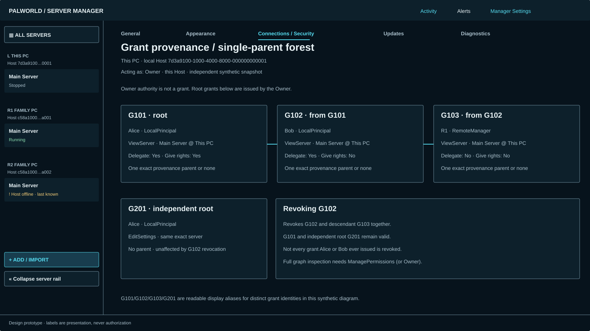
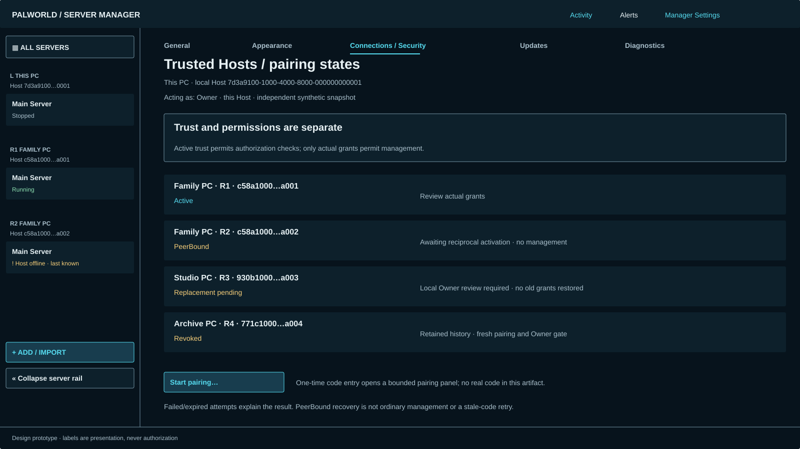

# Astra #37 — Manager Settings, trust and authorization

Trial reference: [#37](https://github.com/shoemin/Palworld-Server-Manager/issues/37), parent #18. Static design using accepted [#34](../astra-34/README.md)/[#35](../astra-35/README.md) components. No pairing/authentication/grant implementation. Every board is an independent synthetic scenario, with the acting principal and exact local Host context visible.

| Board | Evidence |
|---|---|
| [General](general.svg) | Host boot versus per-user UI sign-in; stable Host identity and Owner |
| [Appearance](appearance.svg) | Three shared-layout palettes and reduced-motion preference |
| [Trust](trust.svg) | Active, PeerBound, replacement-pending and revoked states |
| [Defaults](defaults.svg) | Factory versus configured template; Owner-only, future activation only |
| [Grants](grants.svg) | Preset preview, Custom, Host/server scopes, exact source and two delegation rights |
| [Provenance](provenance.svg) | Root/delegated grants, single-parent forest and unaffected independent root |
| [Revocation](revocation.svg) | Exact subtree versus trust revocation; local completion does not await peer |
| [Updates/diagnostics](updates-diagnostics.svg) | Separate Host-update authority and redacted actor/target audit |
| [Recovery](recovery.svg) | Structural Owner and exceptional local/offline recovery boundary |

## Scope and context

Manager Settings has General, Appearance, Connections/Security, Updates and Diagnostics as content tabs beside the permanent server rail. Its Host-targeted sections explicitly name the authoritative Host, independently of whichever server was last selected. Per-user presentation/startup preferences are labeled separately. Returning to the workspace restores its prior full ServerRef selection; entering Manager Settings does not silently retarget a server action. A remote Host view is available only through the local Host's authorized route, and is labeled Remote; being Owner on this PC does not make the actor Owner of another PC.

Use full HostId/ServerRef and typed ActorRef values internally. Short names and display aliases (L/R1, G101 etc.) are for readability only, with full identities available through details and collision expansion. LocalPrincipal Alice and RemoteManager R1 are different actor kinds, not interchangeable users. These diagrams are illustrative, not protobuf fixture payloads.

General separates **Host at boot**, a machine service setting requiring the accepted privileged setup/maintenance path, from **UI at sign-in**, a per-user client preference. The ordinary client retains only bounded activation, not general service administration. No new elevation helper, group-management UI or Host.Cli installation mode is invented. Service-mode changes remain unavailable without the proper setup path; Owner is not a substitute for OS administrator privilege. Appearance is client presentation only; theme/motion changes cannot grant authority.

## Trust, pairing and replacement

Trusted Hosts show identity and trust state separately from granted access. `Created`/authenticated-but-not-bound attempts are pending, non-authoritative; `PeerBound` is durable identity binding awaiting reciprocal activation and permits only finalization/recovery traffic. It has no grants. `Active` allows ordinary authorization checks and applies the Host's then-current configured default template once; it does not make all users or servers authorized. The resulting grants must be inspected separately. A pairing-preview template is informational: do not falsely promise that an earlier preview is the immutable activation policy if the Owner changes configuration meanwhile.

Pairing uses the accepted Host-owned protocol. The UI requests a bounded attempt, shows remaining validity/error state and a one-time code entry/display without recording it in audit/diagnostics. No code length or cryptographic library is chosen here. Failed/expired attempts explain the outcome and require the appropriate fresh attempt; a still-valid PeerBound relationship resumes activation without falsely demanding reuse of an expired original code. Uninitialized Hosts offer no ordinary pairing/management surface.

An unproven new credential claiming a known HostId is an Owner-reviewed replacement, never ordinary new-peer pairing. `Revoked` retains history/tombstone identity. Pending replacement permits no management, automatically restored grants or “trust this name” shortcut. Approval is bound to the actual current candidate/Host state; stale or replaced candidates require new review. Any old grants carried forward afterward need the separate explicit audited Owner adoption/re-home procedure. An unchanged, still-proven Active credential and PeerBound activation recovery follow their own accepted paths, not a blanket replacement dialog. Local TLS authentication failure is a security failure, not a dormant-service retry or permission to bypass trust.

## Exact grants and roles

Host capabilities have exactly one Host target; server capabilities have exactly one complete ServerRef. Do not offer “All servers,” a bare profile ID or a fake server for Host updates. `CreateServer`, `ManageHostSettings`, `ManageTrustedManagers`, `ManagePermissions` and `ManageHostUpdates` remain Host-level. `ViewServer`, `StartStopRestart`, `EditSettings`, `ManageBackups`, `TransferExport`, `DeleteServer` and `ManageServerSharing` remain server-level examples from the accepted model. Unsupported/unknown capability values remain unavailable, never enabled by a familiar label.

Explicit server sharing is a grant over one exact server. Visibility is the set of permitted ViewServer targets after both remote authorization boundaries; pairing is not sharing. Changing grant controls cannot enumerate hidden servers or create UI-local permissions. The Host supplies the candidate targets, permissions and effective result.

View Only / Server Operator / Server Administrator / Host Administrator are named preset conveniences, not stored roles. This design **does not define missing preset membership**. Preview the Host-defined per-entry expansion, target, source and delegation flags before applying. A non-Owner's every proposed entry must pass the canonical predicate; no invalid entry can appear to succeed through a preset. Owner application creates root grants through structural Owner authority. No UI silently selects a different source grant, different Host, reduced preset or extra authority to make a request pass. Persisted individual grants remain the truth, and changing a preset label cannot mutate existing grants.

For a non-Owner deriving a grant from G, the UI represents all five accepted checks: G permits delegation; capability type/value and exact target match; the derived grant records G's exact identity; proposed CanDelegate requires G's onward-delegation right; proposed CanDelegateOnwardDelegation also requires that right. The two proposed flags are independent, not one combined “admin” switch. Holding a capability alone is insufficient. `ManagePermissions` grants graph inspection, **not** grant issuance or default-template editing. If graph inspection is unavailable, show the reason rather than revealing hidden relationships. Owner authority itself never appears as a revocable grant row.

No indirect convenience bypasses these rules: role presets, defaults, creator auto-grants, migration, enrollment, Owner adoption/re-home and replacement must use the same accepted Host issuance paths. This slice does not implement or redefine those paths.

## Defaults and provenance

The shipped factory template is identified as least-privilege and Host-provided; its unspecified exact entries are not invented. The currently configured template may differ. The board's CreateServer entry is an explicitly synthetic **Owner-configured** example, not a factory default. All Host entries it creates target this Host; any server entries must name exact existing ServerRefs. Only this Host's structural Owner can modify it, never a holder of ManagePermissions. Changes apply to future activations and do not rewrite existing grants. Known-identity replacement still has its Owner gate and cannot revive old grants silently.

The provenance board is a forest: G101 is an Owner-issued root for ViewServer/Main Server@ThisPC, held by Alice with both delegation rights. G102 derives only from G101, is held by Bob, may delegate but cannot give delegation rights. G103 derives only from G102, is held by RemoteManager R1 and has neither right. Independent Owner-root G201 gives Alice EditSettings on the same server. Revoking G102 affects G102/G103 only; G101 and G201 remain. There is no multi-parent path, capability/target change, or mistaken “revoke everything ever issued by this actor” cascade. Full graph/details include issuer, grantee kind, target, source, time and flags, within the viewer's inspection authority.

## Revocation and recovery

A grant confirmation previews the exact current subtree and unaffected independent grants. The Host rechecks the current graph and authority before commitment; a stale preview cannot authorize an unseen changed effect. Cancel makes no change. Completion reflects the Host's transaction, not simply dismissing a dialog. Detailed general stale/operation-lock UX is #38.

Trust revocation/unpair identifies the exact peer and locally affected grants. This Host's revocation is immediate and unconditional; peer notification is best-effort, never a completion gate. An unreachable peer may retain its own stale state, so never say “removed from both machines” without actual evidence. Trust/credential pin and its dependent authority are retired together locally; the tombstone remains. Re-pairing a known identity requires its accepted fresh pairing/Owner replacement gate, with no silent permission revival.

Owner-only controls are visibly marked as such on this Host, not as a delegable administrator role. There is no ordinary local/remote Owner replacement operation. OS group eligibility cannot enroll/reactivate a principal; non-Owner enrollment/reactivation requires explicit Owner authorization and the accepted per-user credential procedure. Recovery guidance directs the operator to the existing privileged offline preparation on the affected machine, under the same exclusivity lock and with same-transaction audit. Intended-user completion uses the authenticated local client. Initial bootstrap is explicitly privileged and OS-principal-bound, never first-connection wins.

Routine Host credential rotation is staged: wait for remaining peers' durable acceptance or explicit Owner revocation/exclusion. Loss/suspected compromise instead requires the accepted offline fresh local trust anchor and each peer's fresh pairing/Owner-approved replacement. No suspect old credential authenticates its replacement. This UI does not promise that offline recovery instantly heals remote peers or removes the documented hard-crash/stale-descriptor limitation in the architecture. It does not choose #27's pending storage ACL policy or invent recovery commands.

## Updates, diagnostics and unavailable states

Client update state and Host update state are separate. Host update needs exact-target ManageHostUpdates; ManageHostSettings is not enough. Display versions are informational; protocol major/capability negotiation determines availability. The update board deliberately depicts a non-Owner lacking Host-update authority. No install, release, elevation or package-publication action is executed by the prototype. Packaging strategy remains its own gate.

Diagnostics/security history shows authorized actor kind, Host/server target, action, outcome and grant provenance. It never includes pairing/bootstrap/enrollment codes, private keys, tokens or raw secret values. If the requester cannot inspect history/graph, unavailable controls explain the reason without exposing hidden identities. No arbitrary log-file browser or generic admin console is introduced. Export, if offered by the bounded Host contract, remains redacted and explicitly user initiated.

Use separate labels for not authorized, unsupported capability, incompatible protocol, Host offline and trust/recovery required; none may fall back to arbitrary local authority. Keyboard navigation, scope labels, focus return after confirmation, reduce motion and semantic palettes follow #34. At narrow widths stack confirmation/graph nodes in the same order and retain exact target plus source; never hide the second delegation flag. #38 provides final responsive/cross-surface evidence. Static SVG is not live keyboard or screen-reader execution.

## Verification

Run `python docs/design/astra-37/generate.py --check`, retained #34–#36 checks and `python -m mkdocs build --strict`. Regenerate without `--check`; render all nine boards and review every displayed authority path, state, target and consequence. Full two-pass/invariant evidence is in the [trial ledger](../../experiments/astra-v0.5.0-trial.md). Sources are canonical #37 and the accepted [architecture](../../developer/v0.5-architecture.md), especially §§2–5 and 8; no normal-lane implementation was consulted.
