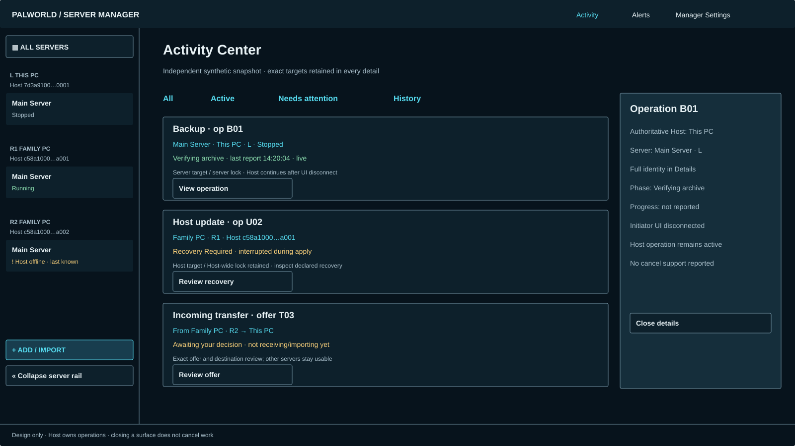

# Astra #38 — final design package

This design-only slice completes the cross-cutting [#18](https://github.com/shoemin/Palworld-Server-Manager/issues/18) direction under [#38](https://github.com/shoemin/Palworld-Server-Manager/issues/38). It consumes accepted #34–#37 and the frozen architecture. It adds no production UI, operation type, authorization rule, offline queue or resumable transfer. All examples are synthetic independent snapshots.

## Artifacts and use

| Artifact | What to inspect |
|---|---|
| [Activity](activity.svg), [21:9](activity-wide.svg) | Exact operation targets, independent Host lifetime, scoped details and attention items |
| [Dark](activity-dark.svg), [Light](activity-light.svg) | Identical geometry through shared semantic tokens |
| [Send](send.svg) | Explicit source/destination and save/stop consequences before offer |
| [Incoming](incoming.svg) | Exact offer review; receipt is not import; no global modal lockout |
| [Conflict](conflict.svg) | Original/draft/current comparison, explicit reload or review, revision rejection |
| [States](states.svg) | Server/Host locks, retained recovery lock and clearly stale data |
| [Bounded logs](logs.svg) | Paused display, explicit stream gap and no arbitrary command/path |
| [Failures](failures.svg) | Transfer/update failure, REST degraded, denial, unsupported and incompatible |
| [Interactive prototype](prototype.html) | Focus return, nonmodal Activity, scoped receipt decision, draft review, target transitions, narrow/enlarged text and themes |

Serve `docs/design` locally, for example `python -m http.server 8768 --bind 127.0.0.1 --directory docs/design`, and open `/astra-38/prototype.html`. The HTML only fetches the adjacent shared token file. Buttons change in-memory synthetic presentation; nothing contacts a Host, sends a transfer, grants authority, saves configuration or stores credentials. Reload resets the simulator. The lab controls are not product UI. SVGs define desktop geometry; HTML demonstrates selected interaction/reflow patterns rather than replacing all prior screen boards.

## Activity and operation ownership

Global Activity is reachable alongside Alerts and Manager Settings. All / Active / Needs attention / History filter **authorized** operations across visible Hosts. Group by owning Host, then status/time; each summary carries operation identity, explicit Host or full ServerRef target, phase, last report and result. Names are labels; retain complete IDs in details and accessibility text with collision expansion from #34. Never merge two operations because their titles match.

At desktop widths, Activity details use a side panel; at narrow widths it overlays without a blocking backdrop. Closing, switching server, changing tab or disconnecting the initiating UI does not cancel work or release a lock. Another authorized client can observe the same Host operation. UI disconnect and Host crash are different events. On reconnect query current authoritative operation state before offering another action; a lost response is not proof that initiation failed. Do not manufacture a replacement operation from UI memory.

Show a determinate bar only when the Host reports meaningful progress with units/total. Otherwise show the named phase and “progress not reported,” without a invented percentage or remaining time. A stale heartbeat labels the entire last-known progress as stale and stops live animation. Completion/failure is Host-reported, not inferred from 100%, closing a panel or loss of the connection. Cancel is offered only if the operation contract says it is currently supported and the actor is authorized; cancellation remains pending until the Host reports its outcome. No universal force-cancel or force-unlock.

## Send and receive

Send to PC is contextual to an exact server. Review the source, destination Host, current state and required consequences. For a running source, the accepted parity flow saves and gracefully stops before export; refusal/failure stops the flow, never copying the live world. A stopped source skips unnecessary stop. Review is explicit about no automatic restart promise. Destination choice cannot silently follow the current rail selection.

Host authorization and safe operation locks are rechecked when initiated. A paired destination is not automatically authorized; route through the local Host and independent destination check. Unsupported/offline/unauthorized targets explain availability without queueing commands. Use only the bounded package flow: world/config metadata, runtime excluded, manifest/per-file validation and fresh runtime at import.

An offer identifies source Host/server, destination Host, package label, declared byte count and expected integrity digest. Sender-controlled names are plain text, never executable paths. Incoming Alerts link to a contextual review panel, also reachable through Activity. No bytes upload until explicit acceptance. Accept authorizes receipt of **this offer**, not all future offers, a grant, a filesystem target or automatic import. Reject affects only that offer. Closing the panel makes neither decision. The Host rechecks exact identity, pending/expiry state, capacity and authorization; a stale offer shows expired/already decided and cannot be accepted again.

Receive uses partial storage; only verified byte count/digest yield a usable package. A failed, cancelled or interrupted transfer never offers its partial artifact for import. Display failure and Host-provided cleanup/recovery state; no “resume bytes” feature is introduced. A fresh retry is a new reviewed offer only after the Host classifies it as safe. Verified receipt leads to the separate #35 Import review and its own validation/runtime/new-profile result. Import never silently overwrites an existing server.

## Conflict, busy and recovery

Every editable aggregate follows the same scoped stale-write pattern, including settings, sharing/grants and Host defaults. Show “save rejected,” exact target, submitted and current revision, and original/draft/current **nonsecret** values. The rejected draft has changed nothing. Reload confirms draft discard; Review lets the user explicitly choose against the latest values. A subsequent save submits that latest revision and may be rejected again. No force overwrite, automatic merge or silent partial save. Newly typed secrets are cleared on conflict/reload and must be re-entered; stored secret values never enter comparisons, errors, search or diagnostics.

An operation lock shows the owning operation and separately its target and lock scope. Server-exclusive work blocks only the exact same server and conflicts with Host-exclusive work on its Host. Host-exclusive work conflicts with every server-exclusive operation on that Host. Independent servers can work concurrently absent a Host lock; other Hosts remain independent. Read-only observations remain available where the Host declares them safe. UI must display the contract's scope, never infer it from the screen or capability name. A server-targeted operation can hold a Host-wide lock.

“Recovery Required” specifically represents the Host's `RequiresManualReview`. Show operation/phase, exact target, retained lock, last durable report and redacted Host-provided guidance. No blind resume, restart, discard or lock clearing. Other dispositions are explicit contract results: safe retry from start, safe resume from a declared phase, or safe discard. UI never selects a disposition itself and never interprets general safe-resume support as the unscheduled resumable-transfer feature. Terminal failure may have resolved its lock; unresolved interrupted work may retain one. These must not share a generic “failed/idle” appearance.

## Freshness and availability

| State | Display and action rule |
|---|---|
| Host offline | Timestamped last-known data, no live badge; writes unavailable, reconnect then refresh/re-authorize |
| Stale stream | Timestamp/source retained, graph gap/no interpolation; no inferred current state |
| REST degraded | Separate fresh process state from stale/unavailable REST/players data; disable REST-dependent safe-stop/restart with reason |
| Permission denied | Exact-target reason without enumerating hidden resources; no elevation-by-UI or trust shortcut |
| Capability unsupported/unknown | Unavailable with explanation; no direct file/process/REST fallback |
| Protocol incompatible | Management unavailable; explain explicit major negotiation, never compare display app versions |
| Local trust authentication failed | Security/recovery guidance from #37; do not retry as ordinary dormant-service activation or bypass pin validation |
| Transfer integrity failure | No usable partial package or import; inspect failure and permitted fresh retry |
| Update terminal failure | Host-reported result and actual lock state; no success/automatic apply inference |

Unavailable controls have nearby persistent explanations and accessible descriptions. Do not depend on disabled controls receiving focus to explain the reason. Notification text never exposes secret values. Alerts announce a meaningful state transition once, without repeated live-region spam on every byte or heartbeat.

## Complete cross-surface handoff

| Accepted #18 surface / state | Concrete design evidence | Implementation boundary |
|---|---|---|
| A1-U, permanent grouped rail, identity collision, All Servers, Add/Import | [#34 shell/identity](../astra-34/README.md), [#35 fleet](../astra-35/fleet.svg) | Host-authorized inventory only; no new transport navigation |
| Overview/lifecycle, local vs remote | [#35 local/remote overview](../astra-35/README.md) | Exact target, Host executor, availability and current locks |
| Players and metrics | [#35 players/metrics](../astra-35/README.md), failure matrix above | Read-only roster, distinct freshness, chart units/gaps; no guessed REST proxy |
| Semantic settings and raw/secret/default handling | [#36 all controls/states](../astra-36/README.md), conflict board and prototype | Host schema metadata; unknown bounds/defaults stay unavailable, exact revision |
| Backup/restore/export/import and guided flows | [#35 backups/create/import](../astra-35/README.md), Send/incoming boards | Stopped-world safety, safety backup, exact restore point, no overwrite/partial adoption |
| Manager General/Appearance/Connections/Security/Updates/Diagnostics | [#37 nine boards](../astra-37/README.md) | Boot versus sign-in; trust versus grants; structural Owner; no storage-policy decision |
| Preset/custom/share/default/provenance/revocation | [#37 grants/forest/revoke](../astra-37/README.md), narrow grant prototype | Exact type/target/source, two independent rights, subtree and nonretroactive defaults |
| Global Activity/Alerts/Send/incoming | This package's Activity/transfer boards and HTML | Nonblocking Host-owned effects; exact offer decision; receipt not import |
| Offline/degraded/denied/unsupported/incompatible | States/failures boards and offline HTML scenario | Last-known never live; no authority or protocol fallback |
| Lock/stale-write/interrupted recovery | States/conflict boards and HTML | Target differs from lock scope; retained recovery, no force override |
| Bounded logs / safe folder actions | Existing #35 More affordance plus detail rule below | Client interactive bounded path only; no general remote filesystem |
| Themes/responsive/keyboard/reduced motion | #34–#37 boards, alternate Activity boards, local HTML exercise | Shared geometry/tokens; no decorative assets copied |

Bounded log detail opens from workspace More into a scrollable detail panel carrying full target, stream source, last timestamp and live/stale state. It provides Pause display / Follow latest / Close; pause affects only presentation and visibly marks it paused, with a gap on resumption when history is unavailable. No command input, arbitrary path entry or generic filesystem browser. Accessible lines are plain text, secret-redacted before transport/presentation, selectable without forcing auto-scroll away from the reader. “Open local server folder” is available only for a local, Host-authorized bounded path in the interactive client. Remote target or denied path explains unavailability. Client diagnostic-folder opening remains separate from Host/server log access. These use existing parity actions, not an extra Files tab or new administration surface.

First-run/recovery screens use #37's scoped guidance: uninitialized Host offers only intended-user bootstrap completion after privileged preparation, not ordinary management; eligible unenrolled user receives Owner-enrollment guidance, not first-connection Owner; failed Host authentication shows recovery guidance, not trust-anyway. Exact protected handoff and backend algorithms remain #42. This design does not unblock #42's dependency on #27.

## Responsive, keyboard and motion review

At 1600×900 / 2100×900 retain the 280-unit rail and existing type scale. Below 1200 the 88-unit rail remains visible; details overlay without a backdrop, content columns stack and long identity/labels wrap. At 640 units and 200% text, preserve all actions, both grant flags, exact targets and close controls using vertical scrolling rather than clipping or shrinking text. This is an additional demonstrated width, not a newly imposed minimum window size. Settings row details, comparison columns and grant nodes follow the same reading order when stacked. Card/button heights grow with wrapped labels.

Production keyboard contract from #34 remains: landmark order chrome → rail → workspace → open panel; rail grouped-tree arrows/Home/End and Enter select, focus alone never selects; collapse retains identity accessible names; focus scrolls into view. HTML uses native buttons/selects to exercise Tab/Enter/Escape, not an implementation of Avalonia's full grouped tree. Nonmodal Activity does not trap Tab; Escape/Close returns to the actual opener (Activity or Alerts). Contextual confirm begins on the safe option, Cancel returns to its trigger, and successful navigation moves focus to the resulting heading/region. Hidden panels leave the focus order.

The prototype uses the actual #34 theme JSON, one DOM/layout, labelled controls, status announcements and a two-unit semantic-accent focus outline. It has no animation; reduced-motion CSS removes animation/transition/smooth scrolling. No OS preference is changed for testing. Production assistive technology, high-contrast mode, full rail-tree navigation and end-to-end Avalonia input remain actual production qualification, not inferred from these browser checks.

## Validation and acceptance boundary

Run `python docs/design/astra-38/generate.py --check`, retained #34–#37 checks and `python -m mkdocs build --strict`. Render every SVG. Browser exercise covers three palettes, 16:9/21:9/narrow/enlarged-text layout, Activity close/focus return, safe draft-discard cancellation, explicit revision review, offer decisions retained on reopen and server/scope transitions. Actual results and corrections are recorded in the [trial ledger](../../experiments/astra-v0.5.0-trial.md), including both review passes.

Final shadow design acceptance is limited to this package and accepted #34–#37 after the two review/CI gates. It is not Windows production parity, service/security integration, screen-reader certification or milestone release qualification. Production issues still need their other dependencies and real tests. The pending #27 Product Decision is neither answered nor bypassed by design acceptance.
