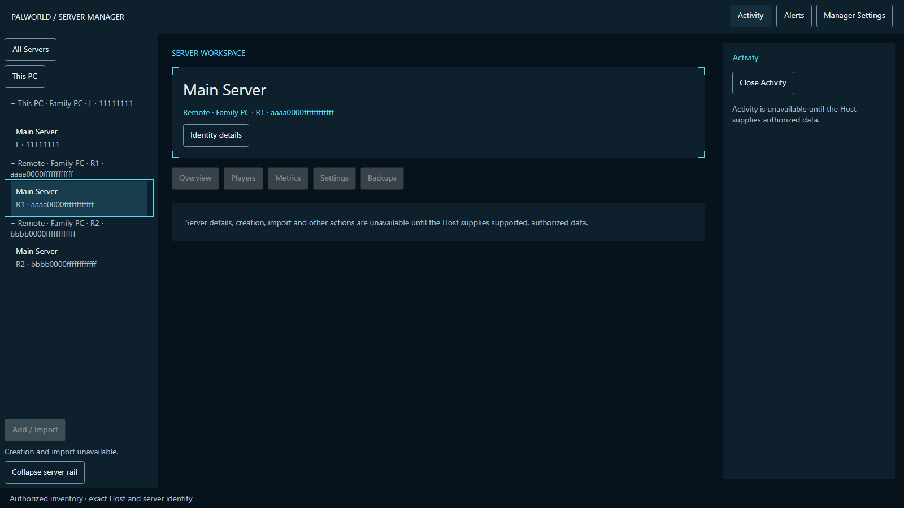
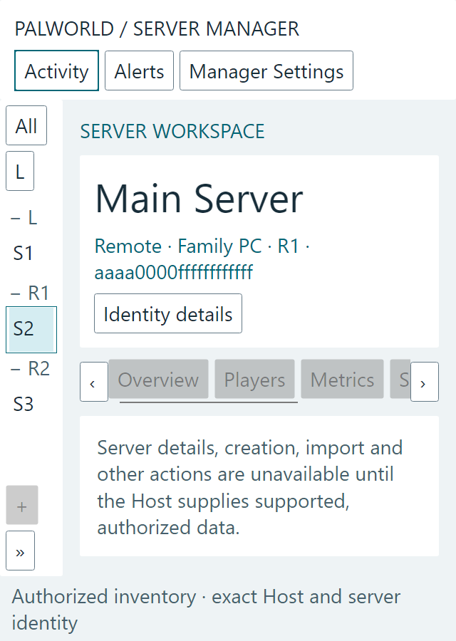

# Actual Avalonia shell renders

Trial reference: #52b. These PNGs are actual `MainWindow` frames rendered by Avalonia 11.1.3/Skia on Windows. Inventory and selection replies are synthetic test inputs; no server is running and no displayed status is fabricated. This is rendering/input evidence, not native screen-reader, window-decoration or actual Host-connection evidence.

| Theme | 1600×900 | 2100×900 | 800×900 |
|---|---|---|---|
| Refined | [16:9](Refined-1600.png) | [21:9](Refined-2100.png) | [Narrow](Refined-800.png) |
| Dark Minimal | [16:9](DarkMinimal-1600.png) | [21:9](DarkMinimal-2100.png) | [Narrow](DarkMinimal-800.png) |
| Light Minimal | [16:9](LightMinimal-1600.png) | [21:9](LightMinimal-2100.png) | [Narrow](LightMinimal-800.png) |

[Disconnected production shell](disconnected.png), [full identity on compact focus](narrow-identity.png), and [640 units with 200% text](enlarged-640.png) provide additional evidence. The Activity overlay intentionally covers part of the workspace at narrow widths; closing it restores the unchanged workspace and focus. Unavailable operations remain explained, with no synthetic percentages or authority.

Reproduce with `dotnet run --project tests/PalworldServerManager.Client.UiTest -c Release -- <output-directory>`. Review all frames after changes; font/rasterizer differences across systems mean these are inspected evidence, not universal pixel baselines. [Implementation and qualification limits](../../developer/v0.5-avalonia-shell.md).
