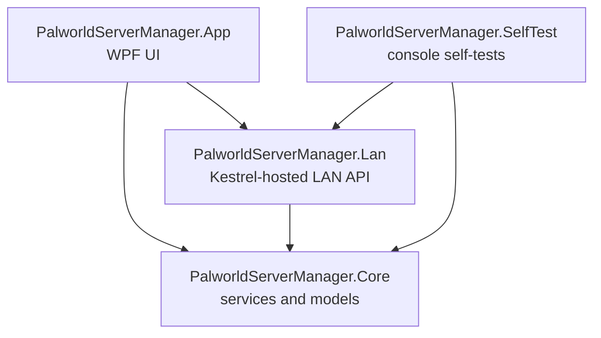
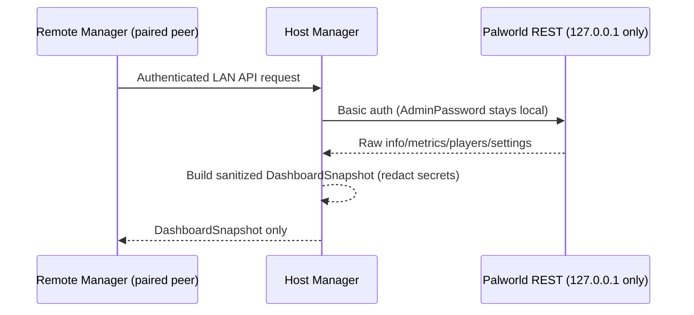

# Architecture

## Projects

- **`PalworldServerManager.Core`** — no UI dependency. Server profiles, SteamCMD integration, the Palworld config parser/settings editor logic, the Palworld REST client, process lifecycle tracking (`ServerProcessService`), backups, portable-package export/import, diagnostics, and the runtime-reattachment/handoff infrastructure (`ProcessIdentityMatcher`, `RuntimeHandoffService`).
- **`PalworldServerManager.Lan`** — the authenticated Manager-to-Manager API (Kestrel, ASP.NET Core minimal APIs), UDP peer discovery, pairing, and LAN state storage. Depends only on `Core`.
- **`PalworldServerManager.App`** — the WPF application: `MainWindow` (Servers), `DashboardView`, `LanView`, and supporting dialogs. Wires everything together in `AppServices`.
- **`PalworldServerManager.SelfTest`** — a plain console app (not a conventional test framework) that runs a linear list of self-checks and prints PASS/FAIL per test. See [Building & testing](building-and-testing.md).

## Data flow: local vs. remote Dashboard

The host Manager is the only thing that ever holds the Palworld AdminPassword. A remote peer only ever receives the already-sanitized `DashboardSnapshot` model — never a raw REST passthrough.

## Runtime process reattachment

`ServerProcessService.ReconcileAsync` runs for every managed profile at Manager startup (before LAN services start). It never starts a process; it only looks for one that's already running:

1. If a runtime-handoff hint exists for this profile (see below), verify it: PID still exists, process name is a recognized PalServer process name, executable path is inside this profile's own install directory, and start time matches within a small tolerance. A hint that fails any of these is discarded, not partially trusted.
2. If nothing verified but a hint existed and nothing is physically running, this is reported as an honest "exited during the restart gap; exit code unavailable" state — never a fabricated clean exit.
3. Otherwise, fall back to a bounded scan for PalServer processes whose executable lives inside the profile's own install directory (this can never match an unmanaged installation elsewhere).
4. On a match, the existing lifetime monitor (`MonitorLifetimeAsync`) attaches to it exactly as if the Manager had just launched it — future exits are still captured and logged.

`RuntimeHandoffService` persists the optional hint mentioned in step 1 (`runtime/update-handoff.json`, atomic write, one-shot consume, rejects stale/malformed data) — currently written by nothing yet, since the self-update flow that will populate it (writing the hint immediately before a Manager self-update restart) hasn't landed. `ProcessIdentityMatcher.IsSafeIdentityMatch` is the pure, independently-unit-tested predicate behind step 1.

## LAN protocol

See the transfer/pairing flow described in the [LAN guide](../guide/lan.md); the wire-level DTOs (`LanAdvertisement`, `PairRequest`/`PairResponse`, `TransferOfferRequest`/`TransferOfferResponse`, `DashboardSnapshot`, etc.) live in `PalworldServerManager.Lan`.
