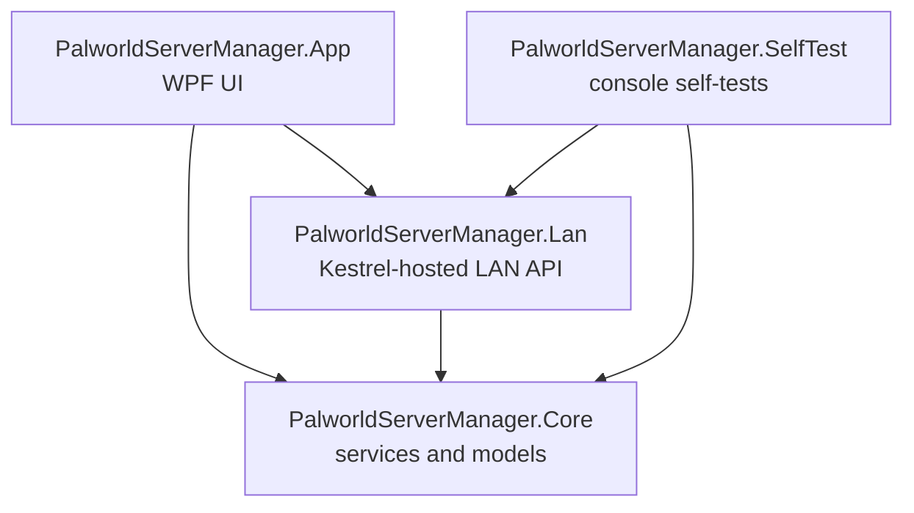
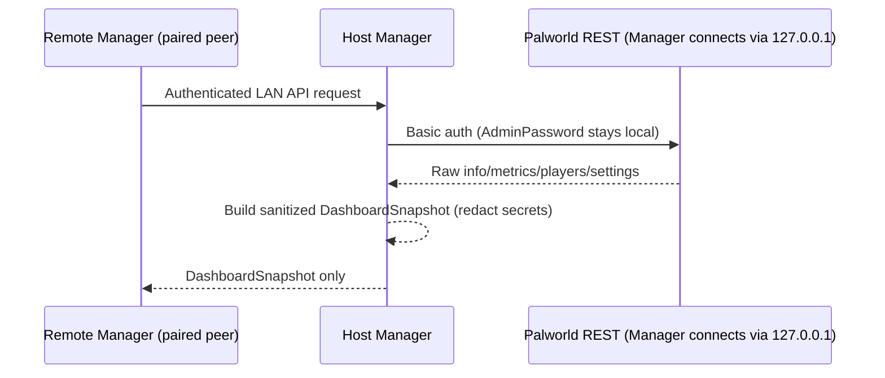

# Architecture

## Projects

- **`PalworldServerManager.Core`** — no UI dependency. Server profiles, SteamCMD integration, the Palworld config parser/settings editor logic, the Palworld REST client, process lifecycle tracking (`ServerProcessService`), backups, portable-package export/import, diagnostics, and the runtime-reattachment/handoff infrastructure (`ProcessIdentityMatcher`, `RuntimeHandoffService`).
- **`PalworldServerManager.Lan`** — the authenticated Manager-to-Manager API (Kestrel, ASP.NET Core minimal APIs), UDP peer discovery, pairing, and LAN state storage. Depends only on `Core`.
- **`PalworldServerManager.App`** — the WPF application: `MainWindow` (Servers), `DashboardView`, `LanView`, and supporting dialogs. Wires everything together in `AppServices`.
- **`PalworldServerManager.SelfTest`** — a plain console app (not a conventional test framework) that runs a linear list of self-checks and prints PASS/FAIL per test. See [Building & testing](building-and-testing.md).

## Data flow: local vs. remote Dashboard

The host Manager is the only thing that ever holds the Palworld AdminPassword. A remote peer only ever receives the already-sanitized `DashboardSnapshot` model — never a raw REST passthrough.

## Runtime process reattachment

`ServerProcessService.ReconcileAsync` runs for every managed profile at Manager startup (before LAN services start). It never starts a process; it only looks for one that's already running:

1. If a runtime-handoff hint exists for this profile (see below), verify it: PID still exists, process name is a recognized PalServer process name, executable path is inside this profile's own install directory, and start time matches within a small tolerance. A hint that fails any of these is discarded, not partially trusted.
2. If nothing verified but a hint existed and nothing is physically running, this is reported as an honest "exited during the restart gap; exit code unavailable" state — never a fabricated clean exit.
3. Otherwise, fall back to a bounded scan for PalServer processes whose executable lives inside the profile's own install directory (this can never match an unmanaged installation elsewhere).
4. On a match, the existing lifetime monitor (`MonitorLifetimeAsync`) attaches to it exactly as if the Manager had just launched it — future exits are still captured and logged.

`RuntimeHandoffService` persists the optional hint mentioned in step 1 (`runtime/update-handoff.json`, atomic write, one-shot consume, rejects stale/malformed data). `ProcessIdentityMatcher.IsSafeIdentityMatch` is the pure, independently-unit-tested predicate behind step 1.

## Manager self-update

`ApplicationUpdateService` (`Core.Services.Update`) owns the check/download/apply state machine (`Idle → Checking → UpdateAvailable → Downloading → ReadyToInstall → Applying`) behind an `IApplicationUpdateBackend` abstraction, so it's fully unit-testable with a fake backend that never touches GitHub or a real installed copy. `VelopackUpdateBackend` is the production implementation, using Velopack's `UpdateManager` against this repo's public GitHub Releases (`GithubSource`, anonymous) and `WaitExitThenApplyUpdates` for the actual apply/restart — that call launches the external Velopack updater and returns immediately, leaving the Manager's own graceful shutdown (stop LAN, then exit) entirely under `ApplicationUpdateService`'s control rather than Velopack's.

Applying an update writes the runtime handoff itself, using `ServerProcessService.BuildHandoffRecord` (a read-only live process scan, not the in-memory tracked-lifetime set) for each managed profile. `ApplicationUpdateService` has no `PalworldRestClient` dependency at all — structurally, it cannot save, shut down, or otherwise talk to a running Palworld server no matter what apply does; the closest it comes to server state is that one read-only handoff builder call.

**`CriticalOperationTracker`** (`Core.Services`) is what stops an update apply from interrupting another Manager-owned operation. Server start/stop, SteamCMD provisioning, backups/restores, legacy import, `.palserver` export/import, settings writes, and LAN transfer send/receive each acquire a scoped lease (`ICriticalOperationTracker.Begin`, released via `IDisposable` so an exception mid-operation can't leak a permanent "busy" flag) for their duration. A running Palworld server is deliberately *not* represented here — it never blocks apply by itself. `ApplyAndRestartAsync` calls `TryBeginShutdown`, which atomically checks "nothing is active" and blocks every subsequent `Begin` call from succeeding in the same step, closing the race where a new critical operation could otherwise start in the gap between the check and the actual restart commitment. A failed apply (handoff write failure, or the backend call itself throwing) calls `CancelShutdown` and reverts to `ReadyToInstall` rather than leaving operations permanently blocked.

## LAN protocol

See the transfer/pairing flow described in the [LAN guide](../guide/lan.md); the wire-level DTOs (`LanAdvertisement`, `PairRequest`/`PairResponse`, `TransferOfferRequest`/`TransferOfferResponse`, `DashboardSnapshot`, etc.) live in `PalworldServerManager.Lan`.
