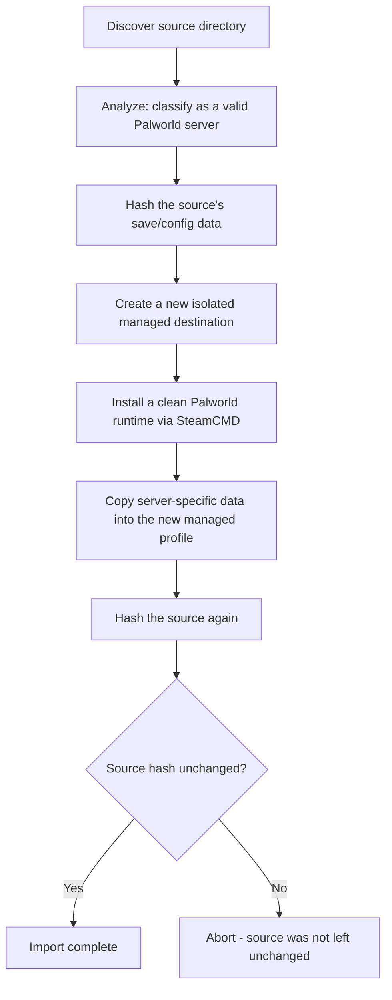

# Importing an existing server

If you already run a Palworld dedicated server outside Palworld Server Manager — installed manually via SteamCMD, for example — you can bring it under management **without modifying the original installation**.

## Why this is safe

Discovering an existing server does **not** give the Manager permission to change it. The unmanaged installation is treated as read-only throughout the import:

The original installation is never converted "in place" — a brand-new, isolated managed profile is created, and the source is only ever read from, then re-hashed at the end to confirm it is still byte-for-byte what it was before the import started.

## How to import

1. Go to **Servers → Find Existing Servers**.
2. The Manager scans the expected Steam/SteamCMD locations for a Palworld dedicated server installation.
3. Select a discovered server. The Manager shows whether it looks like a valid existing server (it checks for `PalServer.exe`, settings, and save data).
4. Confirm the import. The Manager copies the relevant save/config data into a new managed profile with its own fresh runtime, as shown above.

Once imported, the server behaves exactly like a server you created directly in the Manager — it appears in **Servers**, can be started/stopped, backed up, and exported like any other managed profile.
