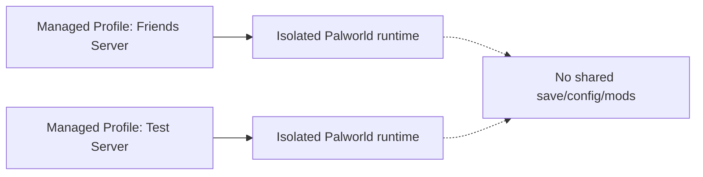

# Your first server

## Creating a new managed server

1. Open Palworld Server Manager and go to the **Servers** tab.
2. Click **Create New Server**.
3. Set a **server name**, **game port** (default `8211`), and **REST API port** (default `8212`).
4. Click **Create**.

Palworld Server Manager installs a dedicated Palworld dedicated server runtime through SteamCMD into its own isolated directory under the Manager's data root — it does not reuse or modify any other Palworld installation on your PC. REST administration and Palworld's built-in save backups are enabled by default for servers created this way, which is what lets the [Dashboard](../guide/dashboard.md) and safe stop/save behavior work out of the box.

The first provision can take a while, since it downloads the full Palworld dedicated server files through SteamCMD. If Steam isn't running, the Manager will prompt with options to launch Steam, continue anonymously, or cancel before it starts.

## Isolation model

Every managed server profile owns its **own** Palworld runtime directory: its own save games, its own configuration, its own mods. Managed profiles never share a save/config/mods directory with each other or with an unmanaged installation. Conceptually:

## Starting and stopping

See [Server Lifecycle](../guide/server-lifecycle.md) for Start, Safe Stop, Force Stop, switching between servers, and what happens if Palworld crashes or the Manager itself restarts while a server is running.
